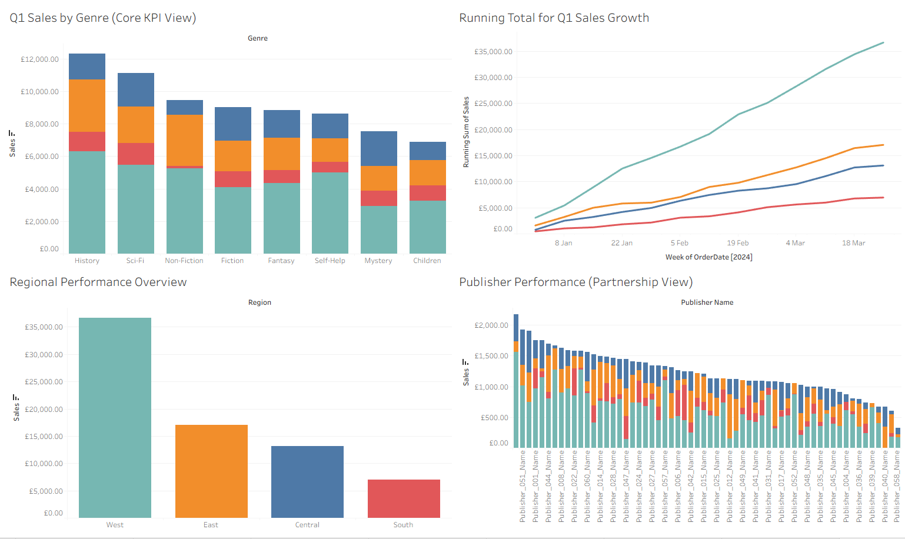

# Bookstore Performance & Publisher Insights — Tableau

## Objective

Analyse Q1 2024 bookstore performance to understand which genres, regions and publishers are performing well and where to focus marketing and purchasing for Q2 2024.

## Dataset

The project combines:

- `Bookstore_Monthly_Sales_2024_01.csv`
- `Bookstore_Monthly_Sales_2024_02.csv`
- `Bookstore_Monthly_Sales_2024_03.csv`
- `Bookstore_Sales.csv`
- `Publisher_Info.csv`

The three monthly sales files were unioned to create the Q1 dataset, and sources were joined using `PublisherID`.

Reported project scope:
- **750 records**
- Key fields include `OrderID`, `OrderDate`, `PublisherID`, `Genre`, `State`, `City`, `Region`, `Quantity`, `UnitPrice` and `Sales`.

## Tools

- Tableau
- Calculated fields
- Data exploration and visual analytics

## Data Quality

A duplicated `OrderID` (`BM-03-493700`) was identified. The project retained the rows because the duplicate identifier was attached to different row-level data; changing the ID would have created an identifier that did not exist in the source.

No missing values were identified.

## Analysis Completed

- Q1 sales by genre
- Regional performance
- State performance
- Weekly sales trends
- Publisher performance by region
- Average sales per order by region
- Sales by order size
- Genre vs region highlight table
- Sales vs quantity outlier analysis
- Running total of Q1 sales growth
- Executive dashboard

## Key Findings

- Total Q1 sales: **£73,792.73**
- History was the strongest genre overall at **£12,316.63**.
- Children’s books were the weakest genre at **£6,886.85**.
- The West generated **£36,666.66**, more than double the East at **£17,056.30**.
- South ended Q1 at **£6,962.80** and had the weakest cumulative growth.
- Central showed different genre preferences: Sci-Fi, Fiction, Fantasy and Mystery exceeded History sales within that region.
- Large orders generated more than double the sales of medium-sized orders.
- Weekly sales fluctuated without a consistent overall upward or downward pattern.

## Business Recommendations

- Prioritise continued investment in the West while protecting customer retention.
- Develop targeted marketing and purchasing strategies for the South.
- Use regional preferences to tailor genre and publisher campaigns.
- Collect customer-level data to analyse repeat purchases, loyalty and high-value customers.
- Investigate promotions, marketing activity and other external factors before treating regional or genre differences as causal.

## Output

## Source Material

The dashboard image above is extracted from the project presentation and represents the project output.
